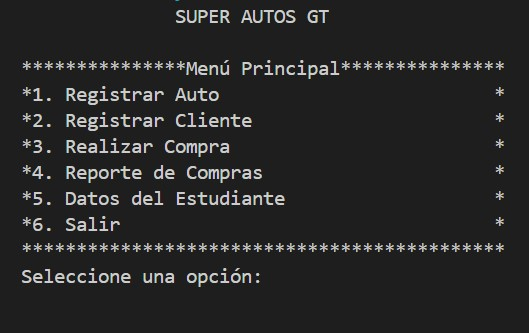
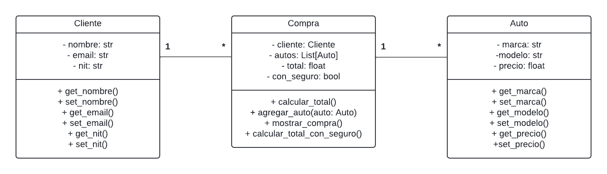

# IPC2_Practica1_201701010 Super Autos GT

Este proyecto es una aplicación de consola para la gestión de autos, clientes y compras en un concesionario ficticio llamado **Super Autos GT**. Permite registrar autos, clientes, realizar compras y generar un reporte de las compras realizadas.

## Estructura del Proyecto

- **main.py**: Archivo principal que contiene el flujo del programa y el menú principal.
- **auto.py**: Clase `Auto` que modela un vehículo en el sistema.
- **cliente.py**: Clase `Cliente` que representa a un cliente.
- **compra.py**: Clase `Compra` que gestiona el proceso de compra de autos por parte de un cliente.

## Clases Principales

### Clase `Auto`

- **Atributos**:
  - `placa`: Identificador único del auto.
  - `marca`: Marca del auto.
  - `modelo`: Modelo del auto.
  - `descripcion`: Descripción del auto.
  - `precio`: Precio del auto.
  
- **Métodos**:
  - Métodos `get` y `set` para cada atributo.

### Clase `Cliente`

- **Atributos**:
  - `nombre`: Nombre del cliente.
  - `email`: Correo electrónico del cliente.
  - `nit`: Número de Identificación Tributaria (NIT) del cliente.

- **Métodos**:
  - Métodos `get` y `set` para cada atributo.

### Clase `Compra`

- **Atributos**:
  - `cliente`: Instancia de la clase `Cliente` que realiza la compra.
  - `autos`: Lista de autos comprados.
  - `total`: Suma total de la compra.
  - `con_seguro`: Indica si la compra incluye un seguro.

- **Métodos**:
  - `agregar_auto(auto)`: Añade un auto a la compra.
  - `mostrar_compra()`: Muestra los detalles de la compra.

## Funcionamiento del Programa

### Menú Principal

El programa se ejecuta a través del archivo `main.py` y presenta un menú principal con las siguientes opciones:

1. **Registrar Auto**: Permite ingresar los datos de un nuevo auto y agregarlo a la lista de autos disponibles.
2. **Registrar Cliente**: Permite registrar a un nuevo cliente en el sistema.
3. **Realizar Compra**: Permite a un cliente seleccionar y comprar autos, con la opción de añadir un seguro.
4. **Reporte de Compras**: Muestra un resumen de todas las compras realizadas, incluyendo el total general.
5. **Datos del Estudiante**: Muestra la información del desarrollador del proyecto.
6. **Salir**: Termina la ejecución del programa.



### Flujo del Programa

1. **Registrar Auto**:
   - El usuario ingresa la placa, marca, modelo, descripción y precio del auto.
   - El auto se agrega a la lista de autos disponibles.

2. **Registrar Cliente**:
   - El usuario ingresa el nombre, email y NIT del cliente.
   - El cliente se registra en la lista de clientes.

3. **Realizar Compra**:
   - Se ingresa el NIT del cliente para verificar si está registrado.
   - El cliente selecciona autos para agregar a su compra.
   - Se ofrece la opción de incluir un seguro, que incrementa el total de la compra en un 15%.
   - Se muestra un resumen de la compra.

4. **Reporte de Compras**:
   - Se muestra un resumen de todas las compras realizadas, incluyendo los detalles de cada compra y el total general.

## Ejecución del Programa

Para ejecutar el programa, asegúrate de tener Python instalado y sigue estos pasos:

1. Clona el repositorio o descarga los archivos.
2. Navega al directorio del proyecto.
3. Ejecuta el siguiente comando en la terminal:

```bash
python main.py
```
## Anexos



## Notas
Este proyecto fue desarrollado como parte de un ejercicio académico para la Universidad de San Carlos de Guatemala. No es un sistema real y su propósito es únicamente educativo.

### Información del Desarrollador
- Desarrollador: Bryant Herrera Rubio
- Enlace al repositorio en GITHub: https://github.com/bryanthr6/IPC2_Practica1_201701010
- Carnet Universitario: 201701010